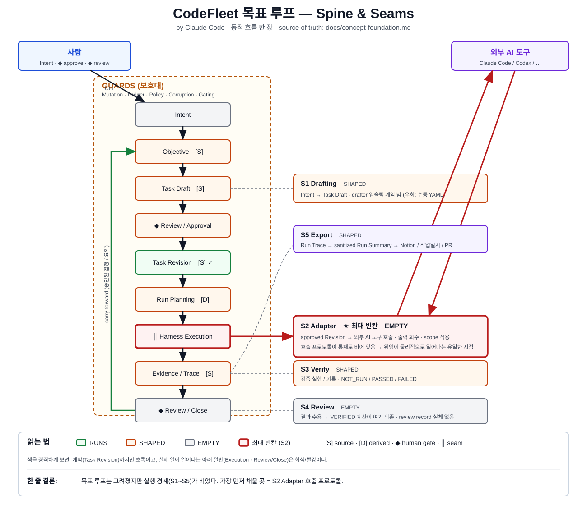

# CodeFleet 아키텍처 — Spine / Seams / Guards

이 문서는 CodeFleet 아키텍처를 **목표 루프 중심**으로 다시 그린 지도다.
FINAL RULE의 source of truth는 `docs/concept-foundation.md`다. 이 문서는 "무엇이 핵심 축이고, 무엇이 보호대이고, 어디가 비어 있는가"를 한눈에 보기 위한 것이다.



아래 ASCII 뷰들은 위 그림을 더 자세히 푼 것이다.

## 왜 다시 그리나

기존 `final-model-architecture.md`는 **설정·정책·안전 축**(Project Profile / defaults / policy lifecycle)을 진행도로 측정한다. 그런데 제품의 목표는 그게 아니다.

```text
CodeFleet의 목표:
  Objective를 실행 가능한 Task로 구조화하고
  각 Task를 역할·범위·가드레일·검증 계약으로 정의하며
  사람이 승인한 Task만 AI 에이전트에게 위임하고
  그 실행 결과를 로그·diff·테스트·리뷰로 추적한다.
```

이 목표를 한 바퀴 돌리는 데 진짜 필요한 건 "정책 schema"가 아니라 **실행 경계(seam)** 다. 그래서 이 지도는 세 시점으로 나눈다.

```text
SPINE   = 목표 루프 그 자체. 한 바퀴 돌려면 반드시 있어야 하는 척추.
SEAMS   = SPINE이 바깥세상/실제 작업과 만나는 경계. 진짜 일이 일어나는 곳이자, 지금 비어 있는 곳.
GUARDS  = SPINE을 감싸는 안전 machinery. 한 번 도는 데는 필요 없고, 여러 번 안전하게 도는 데 필요하다.
```

## 표기 규칙 (의미는 하나씩만)

상태와 역할을 **다른 기호로 분리**한다. (기존 다이어그램은 초록이 "완료"와 "source of truth" 두 뜻이라 헷갈렸다.)

```text
상태 (한 가지 축):
  ✅ RUNS    한 바퀴 돌 만큼 실제로 정의됨
  🟡 SHAPED  상태/규칙은 있는데 실행 mechanic이 빔
  ⬜ EMPTY   거의 비어 있음

역할 표시 (상태와 별개):
  [S] source of truth      (원본 진실)
  [D] derived artifact     (재계산 가능)
  ◆  human gate            (사람 결정 지점)
  ║  seam                  (외부/실작업 경계)
```

---

## View 1 — SPINE (목표 루프)

```text
[사람] Intent
   │
   ▼
Objective              [S] 🟡   맥락/연속성: 어느 작업 묶음인가
   │
   ▼
Task Draft             [S] 🟡   계약 후보        ◀══ SEAM S1: Drafting
   │
   ▼
◆ Review / Approval        🟡   사람 게이트 ①: "이 계약 실행해도 되나"
   │
   ▼
Task Revision          [S] ✅   불변 실행 계약
   │
   ▼
Run Planning           [D] 🟡   effectivePolicy / risk / gate / adapter 선택 계산
   │
   ▼
║ Harness Execution ║      🟡   실행 경계      ◀══ SEAM S2: Adapter  (최종 계약 고정, 구현 남음)
   │
   ▼
Evidence / Trace       [S] 🟡   실행 증거       ◀══ SEAM S3: Verification
   │
   ▼
◆ Review / Close           🟡   사람 게이트 ②: "결과 받아들이나"  ◀══ SEAM S4: Review record
   │
   ▼
[닫힘] derived state (VERIFIED 등)  →  carry-forward(승인된 결정/요약)  →  다음 Objective
```

이 척추에서 색을 정직하게 읽으면: **S1-S5 최소 계약, Project Profile defaults/policies 계약, Harness enforcement 계약, AgentRole / Guardrail taxonomy, Verification 실행 정책, Workspace discovery는 고정됐고, 아직 구현 절단면은 🟡 상태다.** 목표 기준 진짜 남은 일은 v0.1 / v0.2 / final implementation slicing이다.

---

## View 2 — SEAMS (경계 = 진짜 일 = 진짜 빈칸)

SPINE에서 화살표 옆에 붙은 ◀══ 들이다. 여기가 CodeFleet이 "바깥/실작업"과 만나는 지점이고, 목표를 돌리는 핵심 경로다.

```text
S1  Drafting seam        Intent + Profile + discovery ─▶ Task Draft / Task Revision
    상태: 🟡  ★ Task Revision 최소 계약은 고정, Draft Harness 구현은 남음
    고정: Task Revision은 source-only immutable execution contract
    고정: S2/S3/S4가 공유하는 최소 입력은 Task Revision에서 나온다
    고정: scope/guardrails는 path restriction source이고, allowedPaths/deniedPaths는 Run Plan에서 파생된다
    고정: verification.commands는 execution request이며 command permission이 아니다
    빈칸: LLM Draft Harness 입출력, review/edit CLI, YAML validation 구현
    우회: 사람이 YAML 직접 작성

S2  Adapter seam   ║     approved Revision ─▶ 외부 AI 도구 ─▶ 출력 회수
    상태: 🟡  ★ 최종 계약은 고정, concrete transport 구현은 남음
    고정: AdapterRequest -> AgentAdapter -> AdapterResult
    고정: changed-files / command / violation truth는 HarnessObservation이 소유
    고정: Run attempt는 AdapterRequest + HarnessObservation + AdapterResult를 남김
    고정: pre/post state는 HarnessWorkspaceSnapshot(git status/diff + scoped snapshot + hash)
    고정: command truth는 HARNESS_OBSERVED / HARNESS_EXECUTED만 인정
    고정: path violation은 pre/post delta + normalized path + denied 우선 정책으로 판정
    고정: v0.2 Codex transport slice는 final 계약 아래의 VERSION_PLAN
    빈칸: v0.2 구현, scope enforcement 수준, HarnessObservation wiring
    이유: 목표 문장의 "AI 에이전트에게 위임"이 물리적으로 일어나는 유일한 지점.
          이게 없으면 SPINE 아래 절반이 전부 안 돈다.

S3  Verification seam     검증 명령 실행 ─▶ VerificationEvidence ─▶ observedCheck
    상태: 🟡  ★ 최종 계약과 실행 정책은 고정, concrete command runner 구현은 남음
    고정: VerificationEvidence는 Run Trace의 Harness-owned artifact
    고정: observedCheck = PASS / FAIL / SKIP / NONE
    고정: verificationGateResult = SATISFIED / NOT_SATISFIED / WAIVED_ALLOWED
    고정: verificationGateReason = NOT_REQUIRED / PASS / WAIVER / FAILED / MISSING / BLOCKED / UNAVAILABLE
    고정: PASS는 HARNESS_EXECUTED 또는 8.2.2 channel-integrity를 만족한 HARNESS_OBSERVED evidence에서만 나옴
    고정: provider-reported verification은 degraded evidence이며 PASS source가 아님
    고정: v0.2 prompt-only verification은 final 계약 아래의 VERSION_PLAN
    고정: Verification execution policy는 VERIFICATION_EXECUTION_IS_HARNESS_OWNED_EVIDENCE
    빈칸: v0.2 기록 구현, Harness-executed command runner implementation, waiver CLI/UI

S4  Review seam     ◆    Run 결과 ─▶ 사람 수용/거절 기록 ─▶ VERIFIED 계산
    상태: 🟡  (최소 계약 고정, 구현 남음)
    고정: RUN_REVIEW_DECIDED는 Objective ledger durable decision event
    고정: ReviewEvidenceBundle refs/hash가 decision evidence context
    고정: ReviewEvidenceBundle 위치는 .codefleet/reviews/<reviewDecisionId>/
    고정: latest effective review는 ledger order + valid actor/bundle + not invalidated
    고정: ACCEPTED / REJECTED / NEEDS_CHANGES, RETRY는 새 Run reason
    빈칸: ledger implementation

S5  Export seam           Run Trace ─▶ Run Summary(sanitized) ─▶ Notion / 일지 / Issue
    상태: 🟡  (sanitized artifact / adapter field contract 고정, 구현 미정)
    고정: sanitized-run-summary.json / summary.md / redaction-report.json / exportAttempt
    고정: adapter별 field allowlist와 raw evidence export 금지
```

핵심: **S1(Task Revision 최소 계약), S2(Adapter), S3(Verification), S4(Review), S5(Export), Project Profile defaults/policies 최소 계약, Harness enforcement 최소 계약, AgentRole / Guardrail taxonomy, Verification 실행 정책, Workspace discovery는 고정됐다.** 다만 구현 절단면과 실제 end-to-end runtime validation은 남아 있다. 다음 병목은 v0.1 / v0.2 / final implementation slicing이다.

---

## View 3 — GUARDS (보호대, 척추 아님)

아래는 SPINE을 감싸는 안전 machinery다. concept-foundation 분량의 대부분이 여기에 있다. **중요한 점: 이건 한 바퀴 도는 데 필요 없다. 여러 번·여러 사람이·깨져도 안전하게 돌리는 데 필요하다.**

```text
┌────────────────────────────────────────────────────────────────┐
│  GUARDS                                                         │
│                                                                │
│   Mutation Engine   상태 변경 창구 (lock → validate → append    │
│                     → rebuild → validate)                      │
│   Ledger            결정 로그 (append-only, 제안은 안 남김)      │
│   Policy Merge      effectivePolicy = meet(...) 권한 계산        │
│                     "More restrictive wins"                    │
│   Corruption/Repair 불변식 검사 + RepairKind/Mode               │
│   Capability Gating finding severity → 무엇을 막을지            │
│                                                                │
│   ┌──────────────────────────────────────────────────────┐    │
│   │                                                      │    │
│   │          SPINE  (View 1의 목표 루프)                  │    │
│   │                                                      │    │
│   └──────────────────────────────────────────────────────┘    │
└────────────────────────────────────────────────────────────────┘
```

이 보호대를 SPINE보다 먼저 다 구현하면, **개념 검증 전에 무게에 눌린다.** 보호대는 척추가 한 바퀴 돈 뒤에 한 겹씩 덧댄다.

---

## 전체 시스템 한 장

```text
        ┌─────────────┐                         ┌──────────────────────┐
        │   사람      │  ◆ approve   ◆ review   │   외부 AI 도구        │
        │ (gate ①②)  │                         │ Claude Code / Codex   │
        └──────┬──────┘                         └──────────▲───────────┘
               │ gate                                      │ ║ S2 Adapter seam
               ▼                                           │
   ┌───────────────────────────── GUARDS ──────────────────┼───────────┐
   │  Mutation Engine · Ledger · Policy Merge · Corruption ·│Gating     │
   │  ┌────────────────────────── SPINE ───────────────────┼────────┐  │
   │  │ Intent→Objective→Draft→[approve]→Revision→Plan→ ║Execute║ →  │  │
   │  │ Trace→[review]→Close → derived state → carry-forward       │  │
   │  └──────────────────────────────────┬─────────────────────────┘  │
   └─────────────────────────────────────┼────────────────────────────┘
                                         │ ║ S5 Export seam
                                         ▼
                              ┌────────────────────┐
                              │ Notion / 일지 / PR  │
                              └────────────────────┘
```

척추는 가운데를 관통하고, 사람은 위에서 두 번 게이트로 개입하고, 바깥세상(AI 도구·기록 대상)과는 **seam으로만** 닿는다. 보호대는 척추를 감싼다.

---

## 한 바퀴 돌리기 위한 최소 경로 (critical path)

목표를 *처음 한 번* 돌리는 데 필요한 것만 추리면:

```text
필수:
  - Task Spec 최소 구체 schema      (S1 최소 계약 고정됨)
  - Adapter 최종 계약 + 호출 프로토콜 1종 (S2)  ★ 최종 계약 고정됨
  - Workspace discovery 확정값      (Core invariant 고정됨)
  - Run Trace 수집 (diff/stdout)     (S3 최소: VerificationEvidence 기록)
  - Review record 최소 형태          (S4)

지금은 미루어도 됨 (GUARDS 전체):
  - Mutation Engine · Ledger replay · Corruption/Repair
  - Policy Merge 전체 · Capability Gating
  - Project Profile 전체 schema · defaults 세부
  - Export adapter (S5)
```

즉 **"지금 한 줄로 정하면 가장 목표에 가까운 것" = S1/S2/S3/S4 계약을 v0.2 artifact layout과 CLI flow로 연결하는 것.**
S1은 `Task Revision minimum contract`, S2는 `AdapterRequest -> AgentAdapter -> AdapterResult`, S3는 `VerificationEvidence -> observedCheck -> verificationGateResult / verificationGateReason`, S4는 `RUN_REVIEW_DECIDED + ReviewEvidenceBundle` 최소 계약이 고정됐다.

---

## 기존 다이어그램과 다른 점

```text
기존 (final-model-architecture.md):
  - 진행도 축 = 설정/정책/안전 (Layer 1~2 중심)
  - adapter는 "어느 걸 고르나"(selection)로만 등장, 호출 경계는 한 박스 한 줄
  - 초록이 "완료"와 "source" 두 뜻
  - 실행축(Layer 3)이 본문엔 "정의됨", 그림엔 전부 회색 (불일치)

이 문서 (spine):
  - 진행도 축 = 목표 루프 (실행 경계 중심)
  - Adapter를 seam으로 1급화 (S2, 최대 빈칸으로 명시)
  - 상태(✅/🟡/⬜)와 역할([S]/[D]/◆/║)을 분리
  - 비어 있는 걸 비어 있다고 표시하고, 계약만 고정된 seam은 🟡로 분리
```

## 다음에 할 일 (이 지도 기준)

```text
1. v0.1 / v0.2 / final implementation slicing   ← 다음 병목
```
