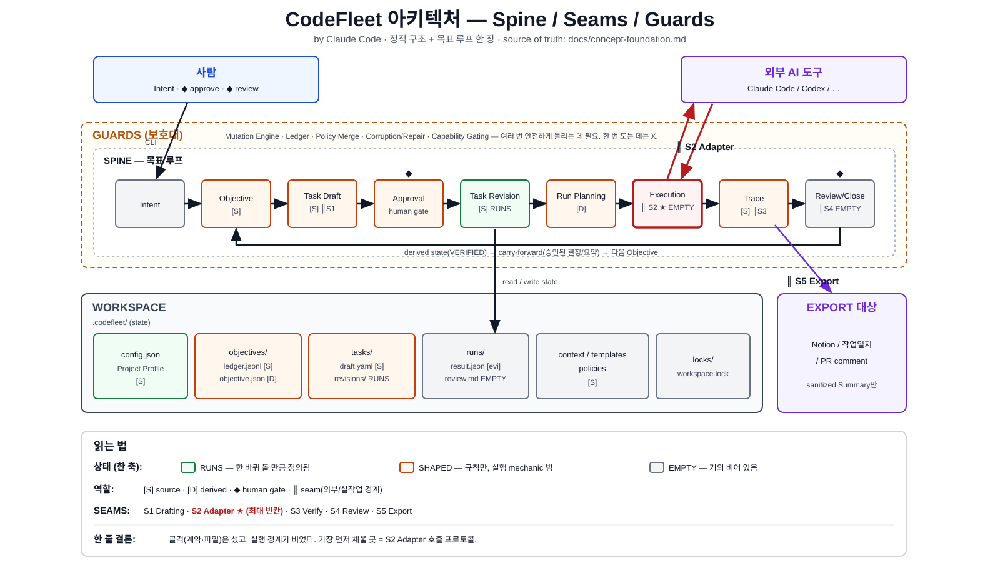

# CodeFleet 전체 구조

이 문서는 CodeFleet의 **정적 전체 구조**를 한 장으로 그린다.
동적 흐름(목표 루프가 어떻게 도는가)은 `docs/architecture-spine-claude.md`, FINAL RULE은 `docs/concept-foundation.md`를 본다.



아래 ASCII 뷰들은 위 그림을 영역별로 자세히 푼 것이다. 표기는 spine 문서와 같다.

```text
상태:  ✅ RUNS(돌 만큼 정의)   🟡 SHAPED(규칙만)   ⬜ EMPTY(빈칸)
역할:  [S] source   [D] derived   [E] evidence   [F] frozen decision context   [M] migration input   ◆ human gate   ║ seam(외부 경계)
구분:  GUARD = 안전 machinery (보호대)   SEAM = 외부/실작업 경계
```

---

## 0. 한 장 요약

```text
┌─ ACTORS ──────────────────────────────────────────────────────────────┐
│  사람                                          외부 AI 도구            │
│  Intent · ◆approve · ◆review                   Claude Code / Codex     │
└───────┬──────────────────────────────────────────────▲────────────────┘
        │ CLI                                           │ ║ S2 Adapter
        ▼                                               │
┌─ CORE (behavior · 전역 상태 없음) ─────────────────────┼───────────────┐
│                                                        │               │
│  CLI 명령                                              │               │
│   ├─ 조회(show/list) ───────────────────────┐          │               │
│   └─ 변경 ─▶ [GUARD] Mutation Engine          │          │               │
│                 ├─▶ [SEAM S1] Draft Harness   │          │               │
│                 ├─▶ ◆ Approval → Revision     │          │               │
│                 ├─▶ [GUARD] Run Planning ─────┼─▶ Execution Harness ─────┤
│                 │        (Policy Merge)       │          (Adapter iface) │
│                 ├─▶ ◆ Review / Close [SEAM S4]│                          │
│                 └─▶ [SEAM S5] Run Summary ────┼──────────────┐           │
│  [GUARD] Validation Engine (불변식·corruption·gating)        │           │
└───────┬───────────────────────────────────────┘──────────────┼───────────┘
        │ 읽기/쓰기                                             │ ║ S5 Export
        ▼                                                      ▼
┌─ WORKSPACE (state · .codefleet/) ──────────┐        ┌──────────────────┐
│  config · objectives · tasks · runs · ...  │        │ Notion / 일지/PR │
└────────────────────────────────────────────┘        └──────────────────┘
```

세 평면이다: **ACTORS(사람·AI도구) / CORE(행동) / WORKSPACE(상태).** Core는 전역 상태가 없고, 모든 상태는 각 프로젝트의 `.codefleet/`에만 있다. 바깥(AI 도구·기록 대상)과는 **seam으로만** 닿는다.

---

## 1. 두 소유권 — Core vs Workspace

```text
CodeFleet Core              CodeFleet Workspace
= behavior(동작 규약)        = state(프로젝트별 상태)
= 전역 상태 없음             = .codefleet/ 안에만 존재
─────────────────────       ─────────────────────────
CLI 명령 체계                Project Profile (config.json)
Task / Profile schema        Objective / Queue ledger
Mutation Engine              Task Draft / Revision
Draft / Execution Harness    Run Trace (실행 증거)
Agent Adapter Interface      Carry-forward 상태
Validation Engine            locks
Policy Merge
Run Summary / Export
```

원칙: **Core owns behavior. Workspace owns state.** 같은 Core가 여러 Workspace를 해석한다.

---

## 2. Workspace 디스크 구조 (진실은 여기 있다)

```text
.codefleet/
├─ config.json                  [S] ✅  Project Profile (공유 정책 계약)
├─ local.json                   [S] 🟡  로컬 overlay (restrict-only, git 제외)
│
├─ objectives/
│   └─ <objective-id>/
│       ├─ ledger.jsonl         [S] 🟡  결정 로그 (append-only) ◀ 권위
│       └─ objective.json       [D] 🟡  snapshot (ledger+task+run으로 rebuild)
│
├─ tasks/
│   └─ <task-id>/
│       ├─ task.json            [S] 🟡  head / revision lineage
│       ├─ draft.yaml           [S] 🟡  계약 후보 (mutable)
│       ├─ task-ledger.jsonl    [S] 🟡  draft/revision/approval 변경 이력
│       └─ revisions/
│           └─ <n>.yaml         [S] ✅  불변 실행 계약 ◀ approval/relation 묶임
│
├─ runs/                            (git 제외)
│   └─ <run-id>/
│       ├─ run-plan.json            [D] 🟡  실행 snapshot / resume boundary
│       ├─ adapter-request.json     [E] 🟡  S2 요청 artifact
│       ├─ harness-observation.json [E] 🟡  Harness-owned 실행 증거 ◀ 권위
│       ├─ adapter-result.json      [E] 🟡  provider report
│       ├─ run-summary.json         [D] 🟡  normalized execution summary
│       ├─ prompt.md
│       ├─ stdout.log  stderr.log
│       ├─ git-diff.patch
│       ├─ verification/
│       │   └─ <attempt-id>.json    [E] 🟡  S3 VerificationEvidence
│       └─ review-decision.local.json [M] 🟡  v0.2 migration input only
│
├─ reviews/
│   └─ <review-decision-id>/
│       └─ evidence-bundle.json     [F] 🟡  frozen review context refs/hash
│
├─ context/                     [S] 사람이 쓴 프로젝트 맥락
├─ templates/                   [S] prompt/review/summary 템플릿
├─ policies/                    [S] guardrail/verification 정책
└─ locks/
    └─ workspace.lock                상태 변경 writer 1명 직렬화
```

색을 보면: **config와 revision 계약은 source로 고정됐고, runs/reviews는 실행과 판단이 실제로 지나갈 때 durable artifact로 쌓인다.** 디스크에서도 "계약, 계획, 증거, 판단이 서로 다른 파일로 남는다"가 그대로 보여야 한다.

---

## 3. 데이터 모델 — entity 관계

```text
Objective [S]
   │  (kind: ONE_OFF | SEQUENCE | WORKSTREAM)
   │
   ├─ Queue
   │    └─ Queue Item  ──참조──▶  taskId + taskRevision + relationState
   │         저장상태: WAITING/BLOCKED/SKIPPED/CANCELED
   │         계산상태: NEXT/ACTIVE/DONE/VERIFIED  (저장 안 함, run으로 계산)
   │
   └─ Carry-forward
        CarryForwardItem(type: DECISION|SUMMARY, state: PROPOSED→ATTACHED→…)
        └─ ATTACHED만 다음 Task context로 전달  ◀ raw log/diff 금지

Task [S]
   ├─ Draft   (EDITING → READY_FOR_APPROVAL → ◆approve)  실행 불가
   └─ Revision (immutable)                                실행 가능
        ▲
        │ approval · objective relation · run · summary 가 전부 여기 묶임
        │
        └──▶ Run [evidence]   (taskId + taskRevision + objectiveQueueItemId)
                 ├─ Run-derived State: NO_RUN/ACTIVE/FAILED/DONE/VERIFIED
                 └──▶ Run Summary [D, sanitized]
                          └──▶ CarryForward(SUMMARY) ─▶ 다음 Objective
```

핵심 규칙 세 개:

```text
- 모든 Task는 반드시 하나의 Objective에 속한다 (떠다니는 Task 금지)
- approval/relation/run/summary는 taskId가 아니라 taskRevision에 묶인다
- 같은 진실을 두 곳에 원본 저장하지 않는다 (DONE/VERIFIED는 계산, SKIPPED는 저장)
```

---

## 4. Core 컴포넌트 — 무엇이 어떤 역할인가

```text
컴포넌트              역할                          분류        상태
──────────────────────────────────────────────────────────────────
CLI                  명령 진입점                    -          🟡
조회 명령            show/list (lock 없이 읽기)      -          🟡
Mutation Engine      상태 변경 단일 창구             GUARD      🟡
  └ lock→validate→append→rebuild→validate
Draft Harness        Intent→Task Draft (bounded     SEAM S1    🟡
                     discovery, 실행 안 함)
◆ Approval           Draft→immutable Revision        human gate  🟡
Run Planning         effectivePolicy/risk/gate/      GUARD      🟡
  └ Policy Merge       adapter 선택 계산
                     "More restrictive wins"
Execution Harness    approved Revision만 실행         -          ⬜
Agent Adapter iface  외부 AI 도구 호출/회수          SEAM S2    ⬜ ★
Run Trace 수집       stdout/diff/verification 기록    SEAM S3    🟡
◆ Review/Close       결과 수용→VERIFIED 기록         SEAM S4    ⬜
Run Summary/Export   sanitized 결과 내보내기         SEAM S5    🟡
Validation Engine    불변식 검사·corruption·         GUARD      🟡
                     capability gating
```

**GUARD(보호대)는 대부분 🟡까지 와 있고, SEAM(외부 경계)은 ⬜이 몰려 있다.** 특히 S2(Adapter)는 ⬜★ — 목표를 돌리는 데 제일 중요한데 제일 비었다.

---

## 5. 4분류 — 무엇이 진실이고 무엇이 파생인가

```text
Source of Truth (원본·수정/승인 대상)
  Core Invariants · Project Profile · Local Overlay
  Objective/Queue Ledger · Task Draft · Task Revision · Run Options

Derived Artifact (재계산 가능)
  objective.json snapshot · Run Plan · effectivePolicy
  computed Risk · Verification Plan · Run Summary
  Queue 계산상태(NEXT/ACTIVE/DONE/VERIFIED)

Evidence Truth (실행 사실·수정 안 함)
  Run Trace (stdout/stderr/diff/command log/verification result)

Decision Record (evidence에 대한 사람/정책 판단)
  Approval · Review · Close/Retry/Reject · Corrective Event
```

불변식: **과거 객체를 고치지 않는다.** 새 Draft / 새 Revision / 새 Run / corrective event로 전진한다. derived는 언제든 source에서 다시 만든다.

---

## 6. 이 구조와 SPINE의 관계

```text
이 문서 (structure)      = 정적: 무엇이 있고 어디에 사는가 (entity·파일·컴포넌트)
spine 문서 (spine)       = 동적: 목표 루프가 어떻게 흐르는가 (Intent→…→Close)
concept-foundation       = 규칙: 각 상태/전이/검증의 FINAL RULE
```

세 문서를 겹쳐 읽으면:

```text
- structure에서 entity와 파일 위치를 잡고
- spine에서 그것들이 한 바퀴 도는 경로를 따라가고
- concept-foundation에서 각 단계의 정확한 조건을 확인한다
```

## 7. 전체에서 본 빈칸 (우선순위)

```text
⬜ S2 Agent Adapter Interface   ← 전체에서 제일 중요한 빈칸
⬜ Execution Harness 실행 mechanic (S2에 의존)
⬜ Review/Close record (S4)      ← VERIFIED 계산이 여기 의존
🟡 Task Spec 구체 schema         ← entity는 있는데 필드 모양이 candidate
🟡 Run Trace verification 기록 (S3)

미룸(GUARD): Mutation Engine 완성 · Ledger replay · Corruption/Repair
            · Policy Merge 전체 · Project Profile 세부 schema · Export(S5)
```

전체 구조를 다 그려놓고 봐도 결론은 같다 — **골격(entity·파일·계약)은 섰고, 살(실행 경계)이 비었다.** 가장 먼저 채울 곳은 변하지 않는다: **S2 Adapter.**
