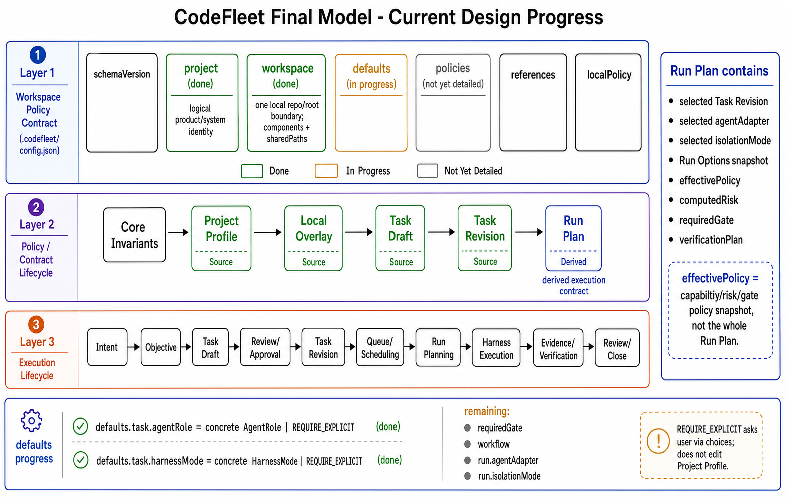

# CodeFleet Final Model Architecture

This page captures the current final-model design progress for CodeFleet.

Current progress:

- Project Profile top-level structure is defined.
- `project` and `workspace` boundaries are defined.
- Policy / contract lifecycle and execution lifecycle are defined.
- `Run Plan` is separated from `effectivePolicy`.
- `defaults` is in progress.
- `defaults.task.agentRole` and `defaults.task.harnessMode` are defined.

Remaining defaults topics:

- `defaults.task.requiredGate`
- `defaults.task.workflow`
- `defaults.run.agentAdapter`
- `defaults.run.isolationMode`
