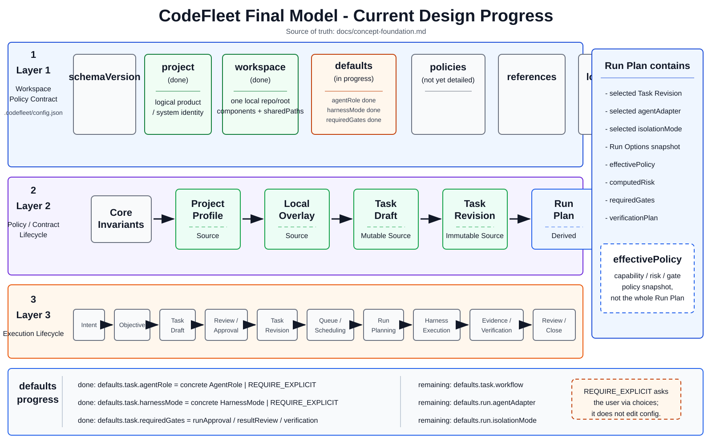

# CodeFleet Final Model Architecture

This page captures the current final-model design progress for CodeFleet.
The source of truth for final-model rules is `docs/concept-foundation.md`.

Archived progress snapshots are kept under `docs/assets/archive/` for history only.

Current progress:

- Project Profile top-level structure is defined.
- `project` and `workspace` boundaries are defined.
- Policy / contract lifecycle and execution lifecycle are defined.
- `Run Plan` is separated from `effectivePolicy`.
- `defaults` is in progress.
- `defaults.task.agentRole` is defined.
- `defaults.task.harnessMode` is defined.
- `defaults.task.requiredGates` is defined as `runApproval`, `resultReview`, and `verification`.
- `defaults.task.workflow` is defined as `PLAN`, `INSPECT`, `APPLY`, `VERIFY`, and `REVIEW` procedural stages.
- `defaults.run.agentAdapter` is defined with project policy allowlist, local availability, and Run Plan resolution evidence.
- `policies.agentAdapters` is defined as a first-class policy block.

Remaining defaults topics:

- `defaults.run.isolationMode`
