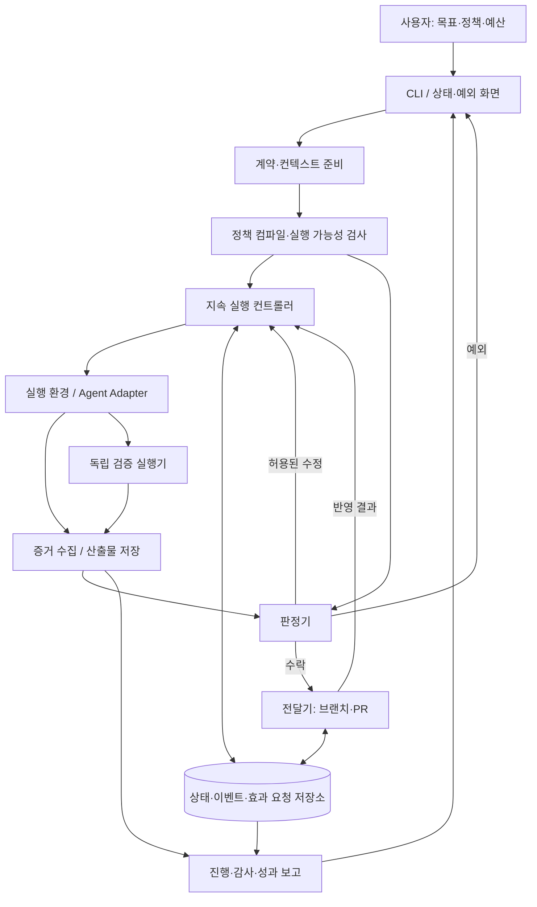
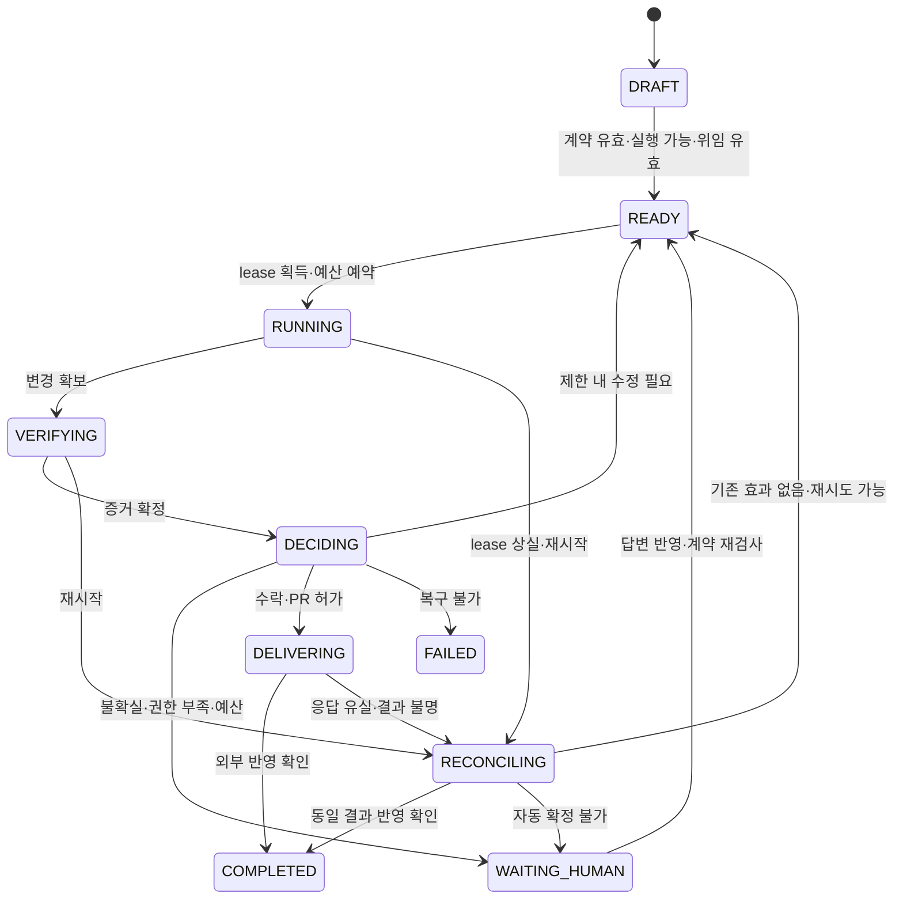

# 제품 완성 아키텍처

작성일: 2026-09-30. 상태: 제안. 아래 컴포넌트·스키마·명령은 목표 설계이며 구현된 API를 뜻하지 않는다.

## 알파 실행 범위 결정

사용자가 본 로드맵 실행을 요청한 후 초기 수직 경로를 다음과 같이 좁혔다. 공급자는 도구 없는 구조화된 편집 제안을 반환한다. Harness가 정확히 허용한 파일에만 적용하고, Node 기본 테스트 실행기를 Docker의 네트워크 없는 제한된 컨테이너에서 실행한다. 공급자에게 임의 명령 실행·파일 편집 권한을 주지 않는다. 초기 지원은 의존성 설치가 필요 없는 Node 프로젝트다. Java·임의 빌드 도구는 미지원으로 명시한다.

이는 일반적인 CLI 에이전트의 모든 실행을 관측한다고 주장하는 대신 실제로 강제할 수 있는 경계를 제품 범위로 정한 것이다. 기존 엔진은 역사·호환 경로로 남기고 별도 alpha 진입점에서 이 수직 경로를 구현한다. PR 자격증명은 전달 단계에서만 사용한다.

사전 검사기 판정 검증: `decision-001`은 아래 표의 **금지되는 결합** 열과 격리 제약을 정체 증거로 읽었고, `decision-002`는 정책 철회 시 거부·실패 반증 수락 조건을 결정 번복으로 읽었다. 원문은 모두 목표 제약으로 실행 성공 주장이나 서로 충돌하는 결정이 아니다. 두 후보는 원문 문맥 대조로 부적합 판정했다. 진행 현황 후보는 검사기가 근거 부족으로 제외했다. 새 제품 구현 완료나 전체 문서의 정확성을 보증하는 판정은 아니다.

## 설계 선택

첫 버전은 로컬 우선, 단일 운영자, 한 저장소의 변경 작업 직렬 실행으로 제한한다. 기존 TypeScript 자산을 활용하되 실행·관측·판정을 모듈로 분리한다. 별도 마이크로서비스나 클라우드 제어면을 만들지 않는다.

실행 제어는 CodeFleet이 맡고, 코드 생성 루프는 외부 Agent Adapter가 담당한다. 공급자 고유 이벤트를 제품의 진실로 삼지 않는다. 검증 가능한 실행 환경과 독립 검증을 연결한다. 첫 지원 어댑터 하나를 실제 계약 테스트로 선정한 후 확장한다.

저장은 로컬 트랜잭션 저장소(SQLite를 기본 설계 후보로 둠)와 내용 해시 기반 산출물 파일을 분리한다. 드라이버·배포 적합성은 M0에서 검증한다. 기존 JSONL 원장을 무조건 마이그레이션하지 않고 읽기 전용 증거로 보존한다.

## 컴포넌트 관계

각 명령 처리에서 상태 전이와 효과 요청은 같은 트랜잭션으로 저장한다. 외부 프로세스·GitHub 호출 자체를 그 트랜잭션 안에 넣지 않는다.

## 모듈 책임과 경계

| 모듈 | 책임 | 금지되는 결합 |
| --- | --- | --- |
| Contract / Context | 목표, 범위, 완료 조건, 출처, 승인 revision 구성 | 생성한 초안을 자동으로 실행 허가로 취급 |
| Policy | 기능별 권한 교집합, 위임 유효성, 실행 가능성 | 에이전트 요청으로 권한 자동 확대 |
| Controller | 큐, 상태 전이, 예산 예약, 재시도, 중단·재개 | 자체적으로 테스트 성공·업무 완료 판정 |
| Executor / Adapter | 지원 기능 협상, 격리 환경 기동, 실행 종료 | 공급자 자기 보고를 직접 검증 증거로 승격 |
| Evidence | diff·프로세스 결과·환경·한계·해시 기록 | 정책에 따라 원시 관측값 수정 |
| Verifier | 보호된 기준에서 명시적 검증 실행 | 테스트를 실행하지 않았는데 성공으로 처리 |
| Judge | 계약·정책·증거로 결과와 다음 허용 행동 계산 | 프로세스·네트워크·파일 변경 |
| Delivery | 검증한 변경의 브랜치·PR 생성 및 재조정 | 수락만으로 병합·배포 권한 추론 |
| Store / Reporter | 트랜잭션, 조회 모델, 감사·사용자 설명 | 증거를 별도 수동 요약으로 복제하여 사실 생성 |

Judge는 동일한 버전의 계약·정책·증거에 대해 같은 판정을 반환하는 순수 함수로 시작한다. LLM 리뷰는 보조 증거이며 필수 검증 누락을 면제할 수 없다.

## 주요 데이터 계약

| 객체 | 필수 내용 |
| --- | --- |
| TaskContract | schemaVersion, taskId, revision, goal, scope, acceptanceCriteria, verificationSpec, contextManifestHash |
| DelegationPolicy | policyId/version, 허용 저장소·행동·위험 등급·예산, 승인자, 유효기간, 철회 상태 |
| RunPlan | runId, contractHash, policyHash, baseCommit, adapterVersion, environmentFingerprint, isolationCapabilities |
| Attempt | attemptId, parentAttemptId, 시작·종료, 오류 분류, 사용량·측정 가능 여부, 예약 예산, leaseGeneration |
| EvidenceBundle | artifactHash 목록, 관측 주체·authority, 검증 결과, 검사 범위, 미관측 사유, candidateTreeHash |
| Decision | contract/policy/evidence 해시, judgeVersion, ACCEPT/RETRY/ESCALATE/REJECT, 근거, 허용 다음 행동 |
| EffectRequest | effectId, idempotencyKey, 대상 revision, 요청 내용 해시, PENDING/IN_FLIGHT/CONFIRMED/UNKNOWN |
| Intervention | 요청 이유, 선택지와 영향, 답변자, 답변, 갱신 계약·정책 참조, 개입 시간 |

해시 검증과 schema version을 모든 읽기 경계에 적용한다. 비용·종료 코드·관측 가능성의 부재를 빈 문자열이나 0으로 바꾸지 않는다. 공급자가 비용을 제공하지 않으면 unknown/estimate/measured를 구분한다.

## 상태와 루프

pause는 신규 실행과 외부 효과 시작을 막는 제어 플래그다. 실행 중 프로세스는 정해진 종료 정책에 따라 정리한다. cancel은 취소 요청을 먼저 기록하고 자식 프로세스 종료·효과 재조정을 마친 뒤 CANCELED로 확정한다. 이미 생성한 PR은 없었던 것으로 취급하지 않는다. 부분 완료는 사용자에게 표시한다.

기본 루프: 위임·기준 커밋 재확인 → 시도 예산 예약 → 실행 → 증거 확정 → 검증 → 판정 → 수정/질문/전달. 다음 작업은 선행 작업의 검증·전달 조건을 만족해야 시작한다. PR이 아직 병합되지 않았다면 이를 기준으로 후속 코드를 실행할지 명시적으로 결정한다. 첫 버전에서는 서로 의존하는 PR 자동 적층을 지원하지 않는다.

## 권한과 격리

역할은 업무 지침이다. 실제 권한은 workspaceRead, workspaceWrite, processExec, networkAccess, credentialUse, remoteWrite로 분리한다. 유효 권한은 시스템·저장소·사용자 위임·작업 제한의 교집합이다.

정책 프리셋 제안:

| 프리셋 | 자동 허용 | 사람에게 남기는 결정 |
| --- | --- | --- |
| 관찰 | 계획·읽기·검증 계획 | 코드 변경·외부 쓰기 |
| 로컬 위임 | 격리 변경·검증·제한된 수정 | 원격 반영 |
| PR 위임 | 위 항목 및 지정 저장소 브랜치·PR 생성 | 병합·배포·권한 확대 |

첫 공개 사용 릴리스의 상한은 PR 위임이다. 인증, 결제, 파괴적 데이터 변경, 비밀·정책·검증 기준 변경은 기본 자동 처리 대상에서 제외한다. 저장소 내용과 도구 출력은 권한을 부여하는 지시로 취급하지 않는다.

worktree는 변경 분리다. 보안 격리를 주장하려면 프로세스·파일 시스템·네트워크·비밀 접근이 실제로 제한되는 실행 환경이 필요하다. 지원 OS별 강제 가능성을 시험하고 미지원 경계는 명시한다. 에이전트 내부 명령 채널을 관측하지 못하면 관측한 척하지 않는다. 자동 처리 정책이 그 관측을 필수로 요구하면 실행을 거부한다.

PR 자격증명은 Delivery에만 전달한다. 에이전트는 원격 쓰기 자격증명을 받지 않는다. 승인·증거·예산 저장소도 에이전트 쓰기 경계 밖에 둔다. 임의 OS 격리나 모든 공급자 지원은 첫 출시 약속에 넣지 않는다.

## 검증 계약

환경 점검과 업무 검증을 분리한다. 각 완료 조건은 실행 가능한 검증이나 명시적인 사람 확인 조건에 연결한다. 의미 검증이 없는 조건은 자동 수락하지 않는다.

기준 commit의 보호된 검증 자산과 candidate 변경을 사용해 독립 검증한다. 테스트 변경이 업무 자체인 경우 새 테스트만으로 자기 변경을 승인하지 않으며 기존 회귀 기준과 별도 검토 조건을 적용한다. 버전 출력, 테스트 0건, 누락된 필수 결과, 잘린 증거, 해시 불일치는 통과가 아니다.

새 수정 시도는 이전 증거를 재사용하여 완료 처리하지 않는다. 검증 증거는 candidateTreeHash, baseCommit, 환경, 검증 사양에 귀속한다. PR head가 바뀌면 기존 수락은 새 head를 보증하지 않는다.

## 저장·복구·외부 효과

- 원시 산출물을 임시 파일에 쓴 후 해시 확인과 원자적 이름 변경을 수행한다. 그 후 상태 트랜잭션에서 참조한다. 남은 고아 파일은 조회 가능한 정리 대상으로 둔다.
- 상태 전이, 이벤트 append, 효과 요청 outbox를 한 트랜잭션으로 기록한다. 이벤트는 수정하지 않고 보정 이벤트를 추가한다.
- worker lease와 fencing generation을 검사하여 오래된 worker가 새 결과를 확정하지 못하게 한다. PID 존재만으로 소유권을 판단하지 않는다.
- PR 생성에는 작업·검증 revision에서 파생한 안정적 식별자를 사용한다. 요청 후 응답을 잃으면 같은 브랜치·PR을 조회해 실제 상태를 확인한다. 맹목적으로 재생성하지 않는다.
- 외부 시스템까지 정확히 한 번 실행을 보장한다고 주장하지 않는다. 재시도 가능한 요청, 멱등 식별, 확인·재조정으로 중복 효과를 줄인다. 확정 불가는 예외로 남긴다.
- 정책 철회는 새 시도와 외부 효과 전에 재확인한다. 이미 진행 중인 효과는 취소 가능성과 실제 결과를 재조정한다.

## 예산과 오류 처리

시도 시작 전에 남은 시간·시도·비용 예산을 검사한다. 공급자가 비용 상한을 강제할 수 없으면 추정치를 확정 상한처럼 표시하지 않는다. 엄격한 금액 상한이 필수인 정책에서는 해당 실행을 거부하거나 비용 제어가 가능한 경로만 사용한다.

일시적 네트워크·서비스 오류는 제한된 backoff, 테스트 실패는 범위 내 수정, 동일 오류 반복·무변경 반복은 중단, 권한 부족은 질문, 증거 결함은 수락 금지로 처리한다. 새 시도는 실패 원인과 변경 가설을 기록한다. 종료 조건을 변경하는 자동 복구는 허용하지 않는다.

## 기존 자산 활용

| 자산 | 처리 |
| --- | --- |
| 계약 revision·승인 해시, 관측 authority | 개념과 테스트를 이관하고 새 데이터 계약으로 확인 |
| mutation·원장·멱등성 원칙 | 보존. 저장소 구현 변경 시 복구·중복 반증 테스트 선행 |
| 경로·명령 정책, 독립 검증 | 재사용 후보. 운영체제별 강제 범위 재검증 |
| `run.ts`의 결합된 흐름 | 그대로 확장하지 않음. 최소 수직 경로에서 책임별 추출 |
| 단일 권한 축, 수동 진행 전제 | 명시적으로 새 설계로 대체 |
| 기존 감사·실행·결함 기록 | 읽기 전용 역사로 보존. 새 상태는 progress와 새 증거에 기록 |

파일만 나누는 대규모 선행 리팩터링을 피한다. M1에서 한 실제 작업을 새 모듈 경계로 완주시키고, 검증된 동작을 단계적으로 옮긴다. 목표 디렉터리·DB·명령 문법의 구체값은 해당 슬라이스 구현 때 고정한다.
